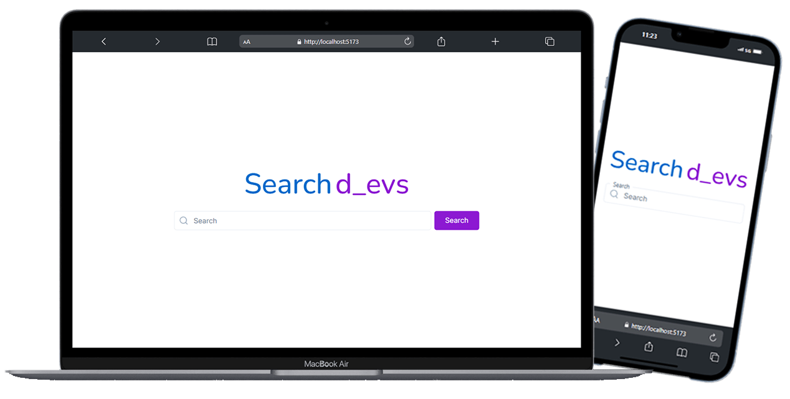
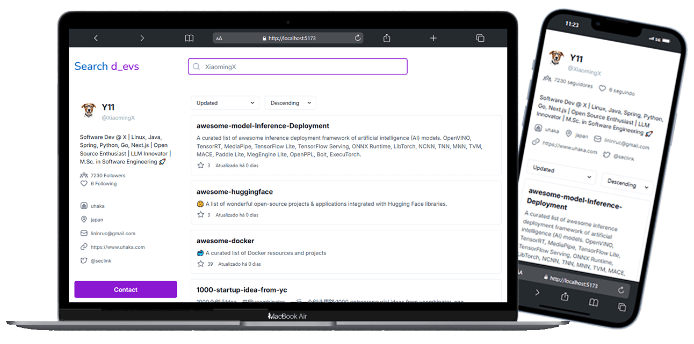

# Petize Teste

Este repositório contém a implementação do teste técnico solicitado pela empresa **Petize**, atendendo a todos os requisitos especificados.

Currently, two official plugins are available:

## Visão Geral do Projeto

Este projeto é uma aplicação baseada em **React** que utiliza **ChakraUI v2** para estilização de componentes e **i18Next** para internacionalização. A aplicação inclui uma funcionalidade de busca de usuários e uma página de perfil que pode ser compartilhada via links únicos.

---





## Descrição do Sistema

O sistema é uma aplicação desenvolvida para realizar a **pesquisa de usuários no GitHub**. Através de uma interface amigável e intuitiva, os usuários podem buscar informações detalhadas de qualquer perfil público disponível na plataforma GitHub.

### Principais Funcionalidades:

1. **Busca de Usuário**:
   - Ao digitar o nome de um usuário no campo de pesquisa, o sistema acessa a API pública do GitHub para recuperar informações completas sobre o perfil pesquisado.

2. **Exibição de Informações do Usuário**:
   - Nome do usuário.
   - Nome de usuário no GitHub (username).
   - Bio (descrição do perfil, caso esteja preenchida).
   - Quantidade de repositórios públicos.
   - Quantidade de seguidores e seguindo.
   - Localização (se disponível no perfil).

3. **Página de Perfil Compartilhável**:
   - Cada perfil pesquisado possui uma página exclusiva acessível via link único no formato `/profile/:username`.

4. **Componentes Modernos e Responsivos**:
   - Estilização feita com **ChakraUI v2** para garantir uma experiência visual agradável e compatível com dispositivos móveis.

5. **Internacionalização**:
   - O sistema suporta os idiomas Português e Inglês, permitindo que o usuário escolha o idioma de sua preferência.

Com essa aplicação, fica simples e rápido consultar dados de desenvolvedores e repositórios no GitHub, sendo útil para recrutadores, empresas ou qualquer pessoa interessada em obter informações de usuários da plataforma.

---

## Funcionalidades

- **React**: O projeto foi desenvolvido utilizando o framework React.
- **ChakraUI v2**: Os componentes são estilizados com ChakraUI, com adaptações em CSS quando necessário.
- **Internacionalização**: O site suporta os idiomas Português e Inglês usando **i18Next**.
- **Rotas**:
  - `Home`: Página para busca de usuários.
  - `Profile`: Exibe o perfil do usuário pesquisado e pode ser acessado através de links compartilháveis (exemplo: `/profile/:username`).
- **Validação de Dados**: As entidades, como repositórios e usuários, são modeladas e validadas utilizando **Zod**.

## URL de Deploy

[https://petize-teste.vercel.app](https://petize-teste.vercel.app)

---
## Instalação e Configuração

1. Clone o repositório:
   ```bash
   git clone https://github.com/Alexdosantos/Petize-teste.git
   ```

2. Instale as dependências:
   ```bash
   npm install
   ```

3. Inicie o servidor de desenvolvimento:
   ```bash
   npm run dev
   ```

4. Acesse o site em http://localhost:5173.


